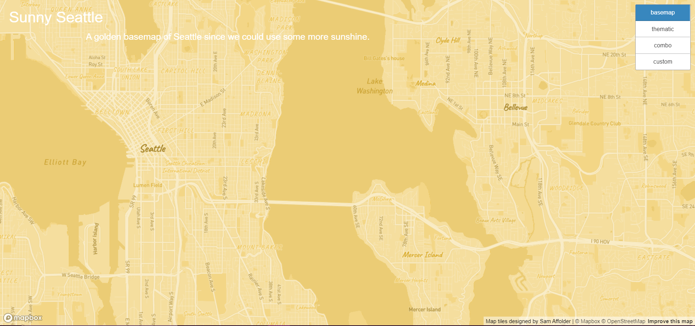
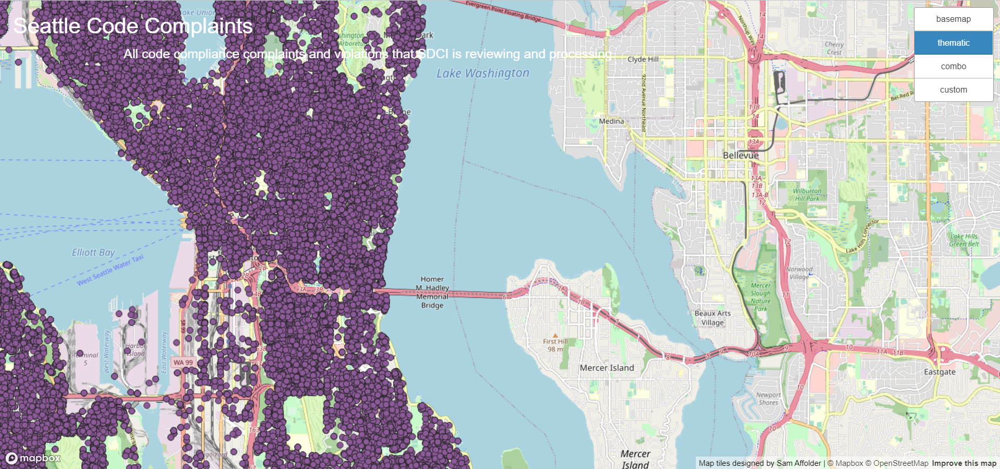
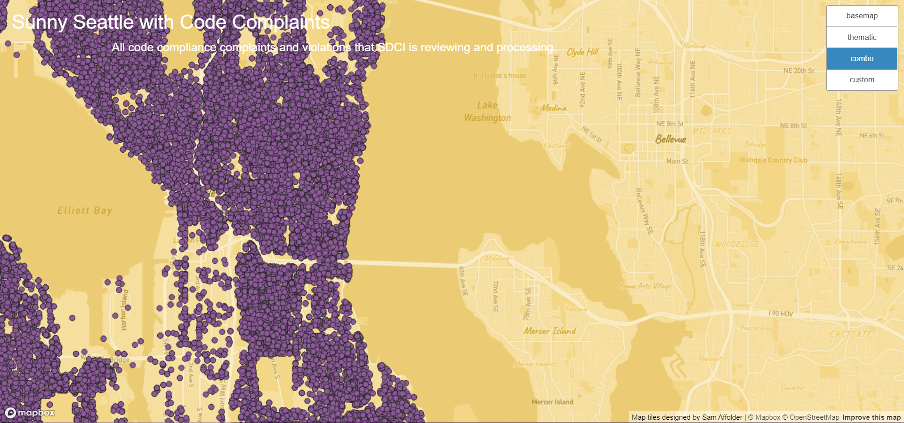
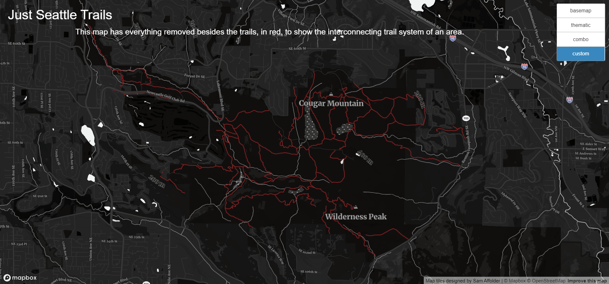

# tileGeneration
### By Samuel Affolder
---

## About
tileGeneration is a web map application project (**[CLICK ME FOR MAP](index.html)**) that uses four tile sets that I had to generate and assemble all the layers to a mapbox made out of Mapbox gs js.

## Maps
All of the maps use a zoom from 10-14 in the Seattle Area since I was concerned with GitHub storage and how long it would take my laptop to create the tiles for more high resolution images.
### Basemap

This is a golden basemap of Seattle.

### Thematic

This map shows the housing code complaints in Seattle since 2003. The data comes from [SDCI](https://data.seattle.gov/Community/Code-Complaints-and-Violations/ez4a-iug7)

 ### Combo

This map combines the first two maps for a nice color scheme.

 ### Custom

This map shows only the trails in the Seattle area since as a runner I am always looking for soft surfaces to run on and this map helps me find where those trails are since they are in red and everything else is blacked out.